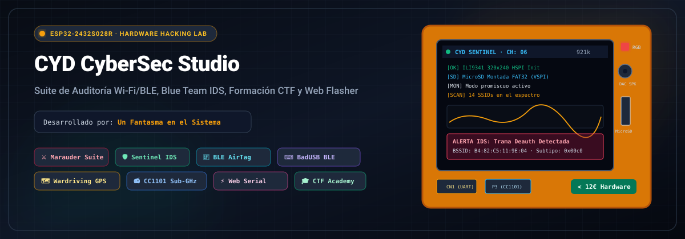
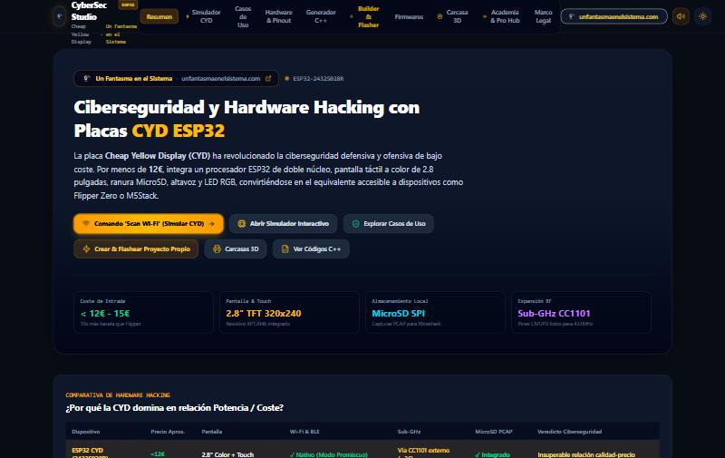
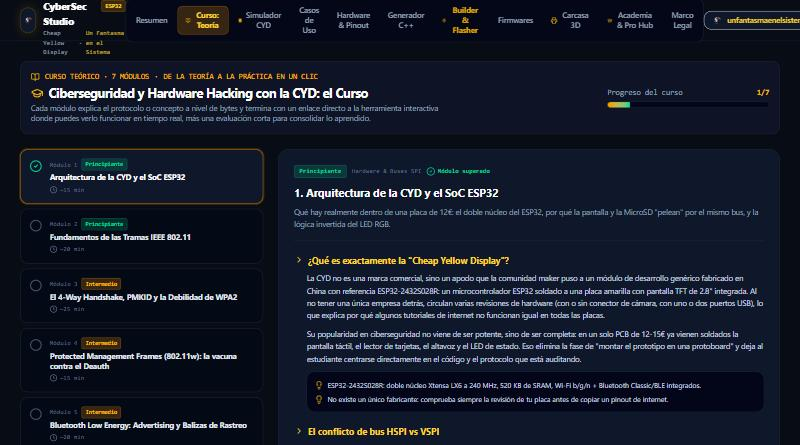
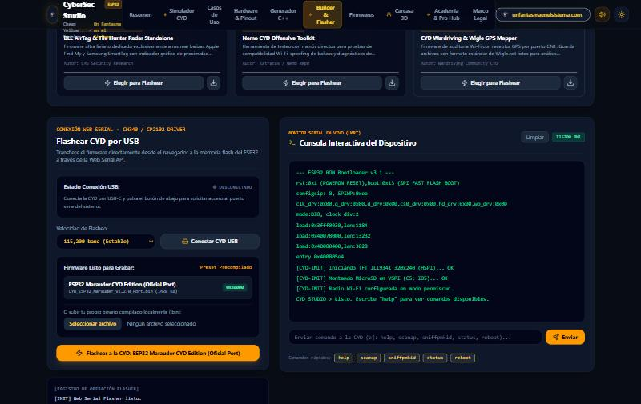
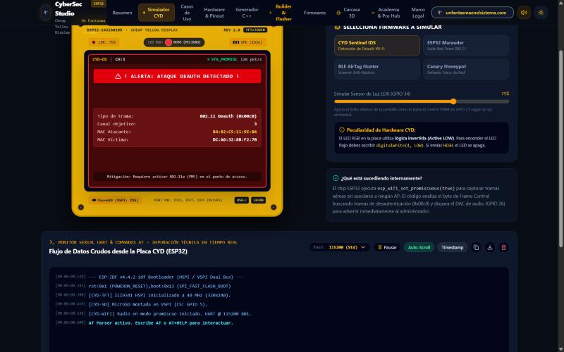
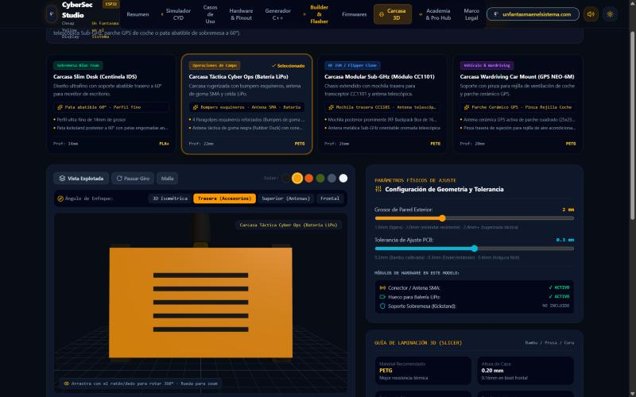
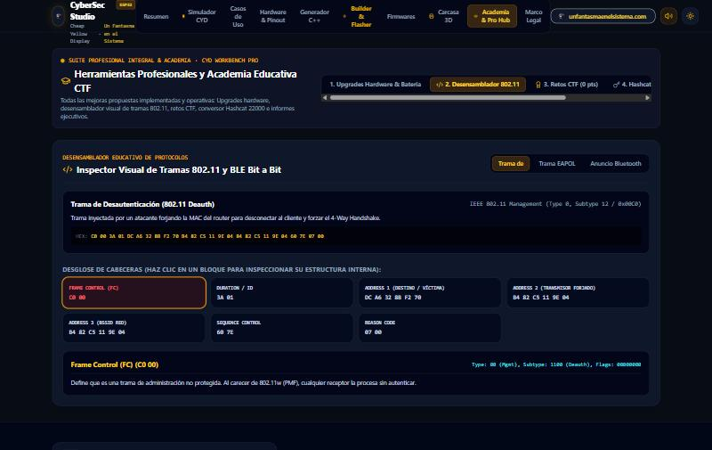

# CYD CyberSec Studio 🛡️⚡
### Suite Integral de Ciberseguridad, Curso Teórico-Práctico, Pentesting Wi-Fi/BLE, Blue Team IDS, Simulador y Web Flasher para placas CYD (Cheap Yellow Display / ESP32-2432S028R)

<p align="center">
  
</p>

<p align="center">
  <a href="https://www.unfantasmaenelsistema.com/"></a>
  <br/>
  <strong>Desarrollado y mantenido por <a href="https://www.unfantasmaenelsistema.com/">Un Fantasma en el Sistema</a></strong>
  <br/>
  <em>Investigación, formación y divulgación de ciberseguridad práctica.</em>
</p>

<p align="center">
  <a href="https://unfantasmaenelsistema.github.io/cyd-cybersec-studio/"><strong>🌐 Abrir la Demo en Vivo (GitHub Pages)</strong></a>
</p>

<p align="center">
  
  
  
  
  
  <a href="LICENSE"></a>
</p>

---

## 📑 Tabla de Contenidos

1. [🎯 Introducción y Propósito](#-introducción-y-propósito)
2. [🛠️ Tecnologías Utilizadas](#️-tecnologías-utilizadas)
3. [📸 Galería de Interfaz](#-galería-de-interfaz)
4. [💻 Instrucciones de Instalación y Ejecución](#-instrucciones-de-instalación-y-ejecución)
5. [📖 Guía de Uso de la Suite](#-guía-de-uso-de-la-suite)
   - [1. Panel de Control & Visión General (Overview)](#1-panel-de-control--visión-general-overview)
   - [2. Curso Teórico: de la Teoría a la Práctica](#2-curso-teórico-de-la-teoría-a-la-práctica)
   - [3. Diseñador de Proyectos Personalizados (Builder)](#3-diseñador-de-proyectos-personalizados-builder)
   - [4. Web Serial Flasher & Monitor Serie AT](#4-web-serial-flasher--monitor-serie-at)
   - [5. Simulador Virtual CYD en Tiempo Real](#5-simulador-virtual-cyd-en-tiempo-real)
   - [6. Generador Paramétrico de Carcasas 3D (Three.js)](#6-generador-paramétrico-de-carcasas-3d-threejs)
   - [7. Academia CTF & Pro Hub Educativo](#7-academia-ctf--pro-hub-educativo)
6. [🔌 Pinout y Anatomía Técnica de la Placa CYD](#-pinout-y-anatomía-técnica-de-la-placa-cyd)
7. [📚 Referencias a los Proyectos Fuente (Reconocimientos)](#-referencias-a-los-proyectos-fuente-reconocimientos)
8. [🚀 Publicación en tu Repositorio de GitHub](#-publicación-en-tu-repositorio-de-github)
9. [🌍 Despliegue en Producción (GitHub Pages)](#-despliegue-en-producción-github-pages)
10. [⚖️ Marco Legal y Responsabilidad Ética](#️-marco-legal-y-responsabilidad-ética)
11. [🌐 Enlaces y Comunidad](#-enlaces-y-comunidad)

---

## 🎯 Introducción y Propósito

La placa **CYD (Cheap Yellow Display / ESP32-2432S028R)** se ha consolidado en la comunidad como la alternativa más accesible y potente para el aprendizaje de hardware hacking, ciberseguridad inalámbrica y desarrollo embebido. Por un coste de apenas **12€ - 15€**, integra un SoC ESP32 dual-core con Wi-Fi/Bluetooth, pantalla TFT táctil a color de 2.8 pulgadas, lector MicroSD y altavoz.

Sin embargo, los usuarios noveles y profesionales a menudo se enfrentan a dificultades técnicas: conflictos de bus entre la pantalla (HSPI) y la MicroSD (VSPI), configuración engorrosa de librerías como `TFT_eSPI` en Arduino IDE, instalación de drivers serie y falta de carcasas adecuadas para proteger la electrónica en auditorías reales.

**CYD CyberSec Studio** nace para resolver estas barreras en una solución única basada en web, estructurada como un **curso teórico-práctico completo**:
* **Curso Teórico de 7 Módulos**: desde la arquitectura del ESP32 y los buses SPI hasta el 4-way handshake WPA2/PMKID, BLE, RF Sub-GHz y el marco legal del hardware hacking — cada módulo enlaza directamente con la herramienta interactiva donde el concepto cobra vida, incluye una evaluación corta y guarda tu progreso y certificado de finalización.
* **Entorno Educativo & Profesional**: Combina explicaciones pedagógicas de bajo nivel con herramientas de análisis avanzadas (conversor Hashcat 22000, calculadoras de autonomía, generador de informes de auditoría).
* **Zero-Install Web Flasher (demo educativa)**: Conecta por USB mediante la **Web Serial API** real del navegador y simula visualmente el flujo completo de flasheo sin instalar Python ni `esptool`; para grabar firmware en hardware real, exporta el `.ino`/`.bin` y usa Arduino IDE, PlatformIO o `esptool.py`.
* **Simulación Visual Bidireccional**: Prueba ataques y defensas (Deauth, PMKID, balizas AirTag, Wardriving) en un gemelo digital interactivo antes de salir al campo.
* **Fabricación Aditiva 3D**: Diseña e imprime carcasas a medida para 4 escenarios tácticos diferentes con previsualización 3D interactiva en Three.js y descarga directa de archivos `.stl` y scripts `.scad`.

---

## 🛠️ Tecnologías Utilizadas

### Frontend & Arquitectura Web
* **React 19**: Biblioteca reactiva con componentes modulares desacoplados y gestión de estado mediante React Hooks.
* **TypeScript 5.x**: Tipado estático estricto para garantizar solidez en las estructuras de tramas de red, puertos serie y modelos de datos.
* **Vite**: Bundler de última generación para compilación ultrarrápida y recarga en caliente de módulos.
* **Tailwind CSS**: Estilizado moderno, diseño responsivo y tema oscuro técnico de alto contraste para auditorías nocturnas.
* **Lucide React**: Iconografía técnica y vectorial limpia para instrumentación de laboratorio.

### Gráficos 3D & Simulación
* **Three.js**: Renderizado 3D en WebGL acelerado por hardware para el visor de carcasas con iluminación direccional de estudio, sombras, malla wireframe, vista explotada multicapa y tornamesa orbital 360°.

### APIs Nativas del Navegador (Web Standards)
* **Web Serial API**: Comunicación serie asíncrona bidireccional directa con los chips UART de la CYD (CH340 / CP2102) a 115200 baudios para flasheo y depuración técnica.
* **Web Audio API**: Motor acústico sintético para emular el altavoz DAC de la placa (GPIO 26) con pitidos de alarma IDS, confirmaciones táctiles sonoras y retroalimentación interactiva.

### Diseño Mecánico & Fabricación Aditiva
* **OpenSCAD**: Motor de código paramétrico generativo para exportar geometrías CSG editables por la comunidad.
* **ASCII STL Generator**: Generador sintético de mallas triangulares 3D nativo en el cliente listo para cargadores y slicers (Bambu Studio, PrusaSlicer, OrcaSlicer, Cura).

---

## 📸 Galería de Interfaz

### 1. Panel Principal & Guía de Inicio Rápido
*Vista del dashboard general con accesos rápidos, estado de periféricos e instrucciones paso a paso de conexión física.*

<p align="center">
  
</p>

---

### 1.5. Curso Teórico de 7 Módulos
*Contenido teórico con evaluación integrada, seguimiento de progreso y enlaces directos a cada herramienta interactiva para practicar lo aprendido al instante.*

<p align="center">
  
</p>

---

### 2. Constructor de Proyectos (Builder) y Web Serial Flasher
*Selector visual de los 7 arquetipos de ciberseguridad, generador de código C++ y consola de flasheo por Web Serial.*

<p align="center">
  
</p>

---

### 3. Simulador Virtual CYD & Monitor Serie AT
*Gemelo digital interactivo con respuesta táctil, telemetría Wi-Fi/BLE, visualizador de LEDs RGB y terminal serie de comandos AT con toggle de tema claro/oscuro.*

<p align="center">
  
</p>

---

### 4. Generador Paramétrico de Carcasas 3D (Three.js)
*Visor orbital 360° con vista explotada de las piezas (bisel frontal, placa CYD y caja trasera), selector de color de filamento y parámetros de tolerancia.*

<p align="center">
  
</p>

---

### 5. Academia CTF & Hub Profesional
*Desensamblador visual de tramas 802.11/BLE, retos forenses interactivos, conversor Hashcat 22000 y calculadora de baterías de campo.*

<p align="center">
  
</p>

---

### Infografías de Arquitectura y Hardware Incluidas en el Repositorio

#### Diagrama de Arquitectura de la Suite:
<p align="center">
  
</p>

#### Pinout Técnico y Mapeo de Buses HSPI/VSPI:
<p align="center">
  
</p>

---

## 💻 Instrucciones de Instalación y Ejecución

Para clonar y desplegar la suite en tu máquina local:

### Requisitos Previos
* **Node.js**: Versión 18.0 o superior instalada ([nodejs.org](https://nodejs.org/)).
* **Gestor de paquetes**: `npm`, `pnpm` o `bun`.
* **Navegador compatible con Web Serial**: Google Chrome, Microsoft Edge u Opera (para las funciones de flasheo directo por USB).

### Instalación Paso a Paso

```bash
# 1. Clonar el repositorio
git clone https://github.com/TU_USUARIO/cyd-cybersec-studio.git

# 2. Acceder al directorio del proyecto
cd cyd-cybersec-studio

# 3. Instalar las dependencias de Node.js
npm install

# 4. Iniciar el servidor de desarrollo local
npm run dev
```

El servidor se iniciará en `http://localhost:3000`. Abre esta dirección en tu navegador para interactuar con la aplicación.

### Scripts Disponibles en `package.json`

| Comando | Acción |
| :--- | :--- |
| `npm run dev` | Inicia el entorno de desarrollo local con Vite en el puerto 3000. |
| `npm run build` | Compila y optimiza la aplicación para producción en la carpeta `dist/`. |
| `npm run preview` | Previsualiza localmente el build de producción optimizado. |
| `npm run lint` | Valida los tipos TypeScript y comprueba la sintaxis del proyecto. |

---

## 📖 Guía de Uso de la Suite

### 1. Panel de Control & Visión General (Overview)
* **Estado de la Placa**: Muestra las especificaciones del microcontrolador y el mapa de periféricos activos.
* **Guía de Inicio Rápido**: Sección dedicada paso a paso para usuarios noveles:
  1. Conexión del cable de datos USB-C/Micro-USB.
  2. Instalación de drivers serie (WCH CH340 o Silicon Labs CP210x).
  3. Configuración de placa `ESP32 Dev Module` y librería `TFT_eSPI` en Arduino IDE.
* **Historial de Eventos de Seguridad**: Registro en tiempo real de eventos detectados y simulados.

### 2. Curso Teórico: de la Teoría a la Práctica
**7 módulos** de nivel creciente (Principiante → Avanzado), cada uno con teoría técnica detallada, una evaluación corta de 1-2 preguntas y enlaces directos a la herramienta interactiva donde practicar el concepto en el momento:
1. **Arquitectura de la CYD y el SoC ESP32** — buses HSPI/VSPI, lógica invertida del LED RGB.
2. **Fundamentos de las Tramas IEEE 802.11** — Frame Control, tipos de trama, por qué un deauth no necesita contraseña.
3. **El 4-Way Handshake, PMKID y la Debilidad de WPA2** — EAPOL, PMK/PTK, por qué WPA3-SAE resiste el ataque de diccionario offline.
4. **Protected Management Frames (802.11w)** — la mitigación real contra el ataque de desautenticación.
5. **Bluetooth Low Energy: Advertising y Balizas de Rastreo** — Company ID de Apple, MAC aleatoria resoluble.
6. **Radiofrecuencia Sub-GHz: del CC1101 a los Rolling Codes** — OOK/ASK, ataque de repetición, por qué KeeLoq lo neutraliza.
7. **Metodología Red/Blue Team y Marco Legal** — Rules of Engagement, Art. 197 bis/264 CP, Directiva 2013/40/UE.

*El progreso y las respuestas correctas se guardan en `localStorage` del navegador; al completar los 7 módulos se desbloquea la descarga de un certificado de finalización en texto plano.*

### 3. Diseñador de Proyectos Personalizados (Builder)
Permite generar firmware a medida seleccionando entre **7 arquetipos de ciberseguridad**:
1. **CYD Marauder Suite** (Red Team Wi-Fi: PMKID, Probe sniffer, Beacon spam).
2. **CYD Sentinel IDS 24/7** (Blue Team: detección acústica y visual de ráfagas Deauth).
3. **CYD BLE AirTag Hunter** (Privacidad: radar de proximidad de balizas Apple / Tile / SmartTag).
4. **CYD Wardriving & GPS Mapper** (Geolocalización con receptor NMEA NEO-6M y formato Wigle CSV).
5. **CYD BadUSB Ghost Keyboard** (Emulación de teclado BLE para DuckyScripts).
6. **CYD Sub-GHz RF Analyzer** (Transceptor CC1101 para frecuencias 433/868 MHz).
7. **CYD Canary Honeypot AP** (Punto de acceso trampa con portal cautivo de advertencia).

*Permite activar/desactivar módulos individuales y descargar directamente el sketch `.ino` para Arduino IDE o el proyecto completo con `platformio.ini`.*

### 4. Web Serial Flasher & Monitor Serie AT
* **Conexión real por Web Serial API**: el botón *Conectar CYD USB* invoca `navigator.serial.requestPort()`, por lo que Chrome/Edge/Opera muestran el selector real de puerto COM/USB del sistema operativo.
* **Flasheo simulado**: una vez conectado, la barra de progreso y el log de flasheo son una **simulación educativa** del proceso (no implementan el protocolo real del bootloader `esptool`/`stub` de Espressif, por lo que no escriben bytes en la flash del ESP32). Pensado para enseñar el flujo de trabajo sin necesitar hardware a mano; para grabar firmware real en una CYD física sigue usando `esptool.py`, Arduino IDE o PlatformIO con los `.bin`/`.ino` descargados desde la pestaña Builder.
* **Catálogo de 6 Firmwares de Referencia**:
  - `ESP32_Marauder_v1.2.0_Port.bin`
  - `CYD_Sentinel_IDS_Guardian_v2.0.bin`
  - `Bruce_MultiTool_ESP32_CYD_v1.7.bin`
  - `CYD_AirTag_Hunter_Radar_v1.1.bin`
  - `Nemo_CYD_Toolkit_v2.4.bin`
  - `CYD_Wardriving_Wigle_NEO6M_v1.0.bin`
  
  *(Los `.bin` descargables desde esta demo contienen un marcador de texto de ejemplo, no un binario ESP32 real; para una grabación real compila el `.ino` generado en el Builder o descarga el firmware original desde el repositorio de cada autor.)*
* **Subida de Archivos Propios**: Arrastra cualquier archivo `.bin` compilado localmente.
* **Monitor Serie Integrado** (consola simulada, no lee el UART real todavía):
  - Velocidad a 115200 baudios.
  - Envío de comandos AT (`scanap`, `sniffpmkid`, `status`, `reboot`).
  - Botones de control (Limpiar consola, Autoscroll, Copiar logs, Toggle de modo Claro/Oscuro).

### 5. Simulador Virtual CYD en Tiempo Real
* **Gemelo Digital del Hardware**: Pantalla táctil interactiva que reproduce la interfaz visual que verías en la placa real.
* **Respuesta de Periféricos**:
  - Zumbador acústico con audio sintetizado mediante Web Audio API.
  - LED RGB con lógica invertida Active LOW (estados visuales rojo, verde y azul).
  - Telemetría espectral con gráficos en vivo de RSSI, canales Wi-Fi y dispositivos BLE.

### 6. Generador Paramétrico de Carcasas 3D (Three.js)
Diseño a medida con **4 geometrías físicas totalmente diferenciadas**:
1. **Slim Desk (Centinela IDS)**: Perfil fino (14 mm) con pata abatible trasera a 60° y micro-rejilla de altavoz.
2. **Táctica Cyber Ops**: Rugerizada (22 mm) con 4 bumpers esquineros de goma, tornillos Allen, estrías de agarre lateral, antena de goma negra táctica con conector SMA dorado y hueco para batería LiPo.
3. **Modular Sub-GHz (CC1101)**: Chasis con mochila posterior prominente de 16 mm con aletas disipadoras, antena metálica telescópica Sub-GHz cromada e interruptor mecánico rojo ON/OFF.
4. **Wardriving Car Mount (GPS NEO-6M)**: Soporte de vehículo (20 mm) con parche cerámico GPS cuadrado (25×25 mm) y pinzas dobles traseras para rejilla de aire acondicionado de coche.

*Controles incluidos: Rotación orbital 360°, vista explotada para inspeccionar encastre interno, selector de color de filamento (PLA+, PETG, TPU), ajuste de tolerancias de PCB (0.15 a 0.45 mm) y descarga de archivos `.stl` y scripts `.scad`.*

### 7. Academia CTF & Pro Hub Educativo
* **Inspector Visual Bit a Bit**: Desglosa tramas 802.11 Deauth (`0x00c0`), capturas PMKID y balizas BLE byte por byte.
* **Retos CTF Gamificados**: Preguntas y escenarios reales para afianzar conocimientos técnicos.
* **Conversor Hashcat 22000**: Convierte datos capturados en formato estándar para auditorías de contraseñas WPA2/WPA3.
* **Calculadora de Batería de Campo**: Estima horas de autonomía en función de los mAh de la batería, brillo de pantalla y modo de radio.
* **Generador de Informes Técnicos**: Exporta informes ejecutivos de auditoría con sello oficial de **Un Fantasma en el Sistema**.

---

## 🔌 Pinout y Anatomía Técnica de la Placa CYD

```text
====================================================================
ESP32-2432S028R (Cheap Yellow Display) — ASIGNACIÓN DE PINES
====================================================================
PANTALLA TFT ILI9341 (Bus HSPI):
  • GPIO 14 -> TFT_SCLK (Clock)
  • GPIO 13 -> TFT_MOSI (Master Out)
  • GPIO 12 -> TFT_MISO (Master In)
  • GPIO 15 -> TFT_CS   (Chip Select Pantalla)
  • GPIO 02 -> TFT_DC   (Data / Command)
  • GPIO 21 -> TFT_BL   (Retroiluminación Backlight - Control PWM)

PANEL TÁCTIL RESISTIVO XPT2046:
  • GPIO 33 -> TOUCH_CS (Chip Select Táctil)
  • GPIO 36 -> TOUCH_IRQ (Interrupción táctil - Pin VP)
  (Comparte líneas de reloj y datos SPI con la pantalla)

LECTOR DE TARJETAS MICROSD (Bus VSPI Independiente):
  • GPIO 05 -> SD_CS    (Chip Select Tarjeta)
  • GPIO 18 -> SD_SCK   (Clock VSPI)
  • GPIO 19 -> SD_MISO  (Master In Slave Out)
  • GPIO 23 -> SD_MOSI  (Master Out Slave In)

INDICADORES Y AUDIO:
  • GPIO 26 -> DAC 2 (Altavoz Zumbador)
  • GPIO 04 -> LED RGB Rojo  (Lógica Invertida: LOW = Encendido)
  • GPIO 16 -> LED RGB Verde (Lógica Invertida: LOW = Encendido)
  • GPIO 17 -> LED RGB Azul  (Lógica Invertida: LOW = Encendido)

PUERTOS TRASEROS DE EXPANSIÓN:
  • Conector CN1 (JST 1.25mm 4 pines): 3.3V, GND, GPIO 22 (RX2), GPIO 27 (TX2)
  • Conector P3 (4 pines): 3.3V, GND, GPIO 35 (Input Only), GPIO 21
====================================================================
```

---

## 📚 Referencias a los Proyectos Fuente (Reconocimientos)

Este proyecto rinde tributo y se apoya en el trabajo de investigación pionero de la comunidad de código abierto:

1. **[ESP32 Marauder](https://github.com/justcallmekoko/ESP32Marauder) (por justcallmekoko)**:
   La suite de referencia mundial para auditorías ofensivas Wi-Fi y BLE en microcontroladores ESP32. El arquetipo de código y los formatos de volcado PCAP de este estudio siguen las pautas establecidas por este proyecto.
2. **[Bruce Firmware](https://github.com/pr3y/Bruce) (por pr3y)**:
   Extraordinario firmware multi-herramienta para placas basadas en ESP32 (incluyendo la CYD, M5Stack y Cardputer), que adapta conceptos populares de dispositivos como Flipper Zero a hardware abierto y accesible.
3. **[Nemo Firmware](https://github.com/nemo-firmware)**:
   Firmware orientado a pruebas de estrés, análisis de radiofrecuencia y pentesting inalámbrico con interfaz gráfica optimizada para pantallas táctiles.
4. **[TFT_eSPI](https://github.com/Bodmer/TFT_eSPI) (por Bodmer)**:
   Librería gráfica de altísimo rendimiento para Arduino que permite aprovechar la aceleración DMA y el bus SPI del ESP32 para dibujar interfaces fluidas en el display ILI9341.
5. **[ESP32 Cheap Yellow Display Wiki](https://github.com/witnessmenow/ESP32-Cheap-Yellow-Display) (por Brian Lough / witnessmenow)**:
   El repositorio comunitario fundacional que documentó los esquemas electrónicos, variantes de hardware, conectores de alimentación y soluciones a fallos de diseño de la placa.
6. **[WiGLE: Wireless Geographic Logging Engine](https://wigle.net/)**:
   Plataforma de mapeo colaborativo de redes inalámbricas cuyos estándares de exportación CSV son utilizados por el módulo de Wardriving de esta suite.

---

## 🚀 Publicación en tu Repositorio de GitHub

Para subir este proyecto a tu perfil de GitHub:

```bash
# 1. Asegúrate de estar en la raíz del proyecto
git status

# 2. Crea un nuevo repositorio vacío en tu cuenta de GitHub:
# https://github.com/new (ejemplo: 'cyd-cybersec-studio')
# NOTA: No marques la casilla "Add a README file" ya que este repositorio ya contiene uno completo.

# 3. Vincula el repositorio remoto (reemplaza TU_USUARIO por tu nombre de usuario en GitHub):
git remote add origin https://github.com/TU_USUARIO/cyd-cybersec-studio.git

# 4. Asegura que la rama sea main
git branch -M main

# 5. Sube todos los commits y ramas a GitHub
git push -u origin main
```

---

## 🌍 Despliegue en Producción (GitHub Pages)

Este repositorio se despliega automáticamente como **demo pública y estática** en GitHub Pages mediante el workflow [`.github/workflows/deploy-pages.yml`](.github/workflows/deploy-pages.yml): cada `push` a `main` ejecuta `npm ci`, `npm run lint` (type-check) y `npm run build`, y publica el contenido de `dist/` directamente con las acciones oficiales `actions/upload-pages-artifact` + `actions/deploy-pages` (sin rama `gh-pages` intermedia).

* **URL pública**: [unfantasmaenelsistema.github.io/cyd-cybersec-studio](https://unfantasmaenelsistema.github.io/cyd-cybersec-studio/)
* **¿Por qué GitHub Pages y no un hosting con servidor?** La suite es una SPA 100% estática que no necesita backend, y GitHub Pages sirve siempre sobre HTTPS — un requisito indispensable para que `navigator.serial` (Web Serial API) funcione en el navegador; sobre HTTP la API queda deshabilitada por política de seguridad del propio navegador.
* **`base` de Vite**: como el sitio vive bajo un subpath (`/cyd-cybersec-studio/`) en lugar de la raíz del dominio, `vite.config.ts` fija ese `base` solo durante `npm run build` (`npm run dev`/`preview` siguen funcionando en la raíz `/` como siempre).
* **Desplegar tu propio fork**: tras subir tu copia a GitHub, entra en *Settings → Pages → Build and deployment* y selecciona **Source: GitHub Actions**; el workflow ya incluido se encarga del resto en el siguiente `push`.

---

## ⚖️ Marco Legal y Responsabilidad Ética

Esta suite de software, sus generadores de firmware y la documentación asociada han sido desarrollados **exclusivamente con fines educativos, de divulgación científica y para la ejecución de auditorías de ciberseguridad debidamente autorizadas**:

* **Marco Jurídico (España y Unión Europea)**: La interceptación no autorizada de comunicaciones, la interferencia en redes mediante paquetes de desautenticación o el acceso no consentido a sistemas informáticos constituyen delitos graves tipificados en los **artículos 197 bis y 264 del Código Penal Español** y en la Directiva 2013/40/UE.
* **Buenas Prácticas de Laboratorio**: Todas las pruebas de radiofrecuencia ofensivas deben ejecutarse en entornos controlados, sobre equipamiento propio o utilizando jaulas de Faraday y atenuadores RF para no afectar a redes de terceros.
* **Exención de Responsabilidad**: Los desarrolladores y colaboradores de este proyecto no se hacen responsables del uso indebido, negligente o ilícito que terceros puedan realizar de este software o del hardware CYD.

---

## 🌐 Enlaces y Comunidad

* **Portal Oficial de Ciberseguridad**: [unfantasmaenelsistema.com](https://www.unfantasmaenelsistema.com/)
* **Documentación Oficial de Espressif**: [espressif.com](https://www.espressif.com/)
* **Reporte de Problemas**: Utiliza la pestaña [Issues](https://github.com/TU_USUARIO/cyd-cybersec-studio/issues) de GitHub para sugerencias, nuevas carcasas 3D o mejoras en el código.

---

<p align="center">
  Hecho con ⚡ y pasión por el hardware hacking en <strong><a href="https://www.unfantasmaenelsistema.com/">Un Fantasma en el Sistema</a></strong>.
</p>
